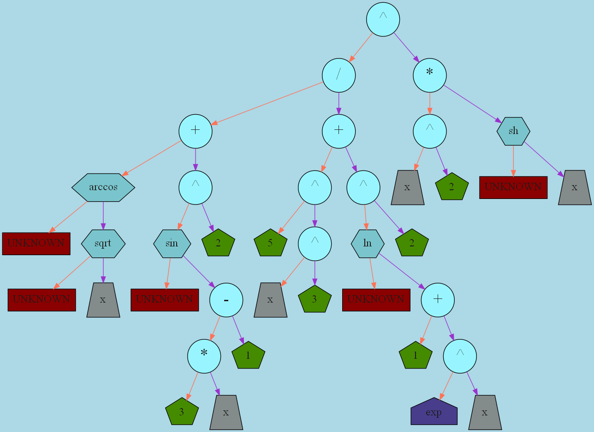
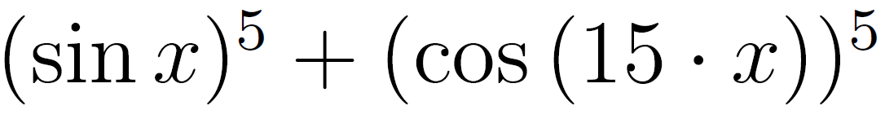

# Differentiator

Дифференциатор - это программа, которая умеет брать производные.

1. [Установка](#установка)

    1.1. [Установка библиотек.](#скачивание-необходимых-библиотек)

    1.2. [Установка программы.](#установка-программы)

2. [Использование](#использование)

    2.1. [Представление математических выражений.](#представление-математических-выражений)

    2.2. [Дифференцирование.](#дифференцирование)

    2.3 [Оптимизация узлов дерева. Упрощение математических выражений](#оптимизация-узлов-дерева.-Упрощение-математических-выражений)

    2.4. [Статья в `LaTeX`.](#Статья-в-`LaTeX`)

## Установка.

### Скачивание необходимых библиотек.

1. Скачать и установить на компьютер [`MikTex for Windows`](https://miktex.org/download). Этот пакет нужен для компиляции файлов в формате Latex и создания pdf статьи о дифференцировании.
2. Скачать [Graphviz](https://graphviz.org/download/#windows) для построения графов деревьев математических выражений.

### Установка программы.

1. Скачать репозиторий.
2. Скомпилировать проект. Открыть файл решения `Akinator.sln` с помощью `Microsoft Visual Studio 2019` и выполнить компиляцию `Ctrl+Shift+B`.
3. Поместить файл `Latex\MIPT_logo.png` рядом в папку с исполняемым файлом. Иначе не будет работать создание статьи дифференцирования в `LaTeX`.

## Использование.

### Представление математических выражений.

Дифференциатор представляет математические выражения в виде дерева. Узлами могут быть: константы (число `е` и `π`.), вещественные числа, переменные (любая маленькая буква латинского алфавита), математические операторы (сложение, умножение, деление, и т.д.), математические функции (синус, косинус, натуральный логарифм, и т.д.).

Представление выражения в виде дерева и создание цветного графа:

<p align="center">
    
</p>

<p align="center">
    
</p>

Дифференциатор записывает дерево в текстовый файл в виде полной скобочной записи. То есть каждый узел окружается круглыми скобками. Внутри скобок узел содержит левого и правого потомков и значение узла. У узлов операторов всегда есть два потомка. У констант, чисел и переменных потомков быть не должно. У функций есть только правый потомок.

Пример записи следующего выражения в текстовый файл:

<p align="center">
    
</p>

```
(
	(
		(sin(x))
		^
		(5)
	)
	+
	(
		(cos((15)*(x)))
		^
		(5)
	)
)
```

Полный список поддерживаемых констант:
```
1. Число е
2. Число π
```

Полный список поддерживаемых математических операторов:
```
1. Умножение.            `*` в текстовом файле, `\cdot` в `LaTeX`.
2. Деление.              `/` в текстовом файле, `\frac{}{}` в `LaTeX`.
3. Сложение.             `+` в текстовом файле, `+` в `LaTeX`.
4. Вычитание.            `-` в текстовом файле, `-` в `LaTeX`.
5. Возведение в степень. `^` в текстовом файле, `^` в `LaTeX`.
```

Полный список поддерживаемых математических функций:
```
Тригонометрические:
1.  Синус                    `sin` в текстовом файле, `\sin` в `LaTeX`.
2.  Косинус                  `cos` в текстовом файле, `\cos` в `LaTeX`.
3.  Тангенс                  `tg` в текстовом файле, `\tan` в `LaTeX`.
4.  Котангенс                `ctg` в текстовом файле, `\cot` в `LaTeX`.
Тригонометрические гиперболические:
5.  Синус гиперболический.   `sh` в текстовом файле, `\sinh` в `LaTeX`.
6.  Косинус гиперболический. `ch` в текстовом файле, `\cosh` в `LaTeX`.
Стандартные математические:
7.  Натуральный логарифм.    `ln` в текстовом файле, `\ln` в `LaTeX`.
8.  Корень квадратный.       `sqrt` в текстовом файле, `\sqrt` в `LaTeX`.
9.  Корень кубический.       `cbrt` в текстовом файле, `\cbrt` в `LaTeX`.
Обратные тригонометрические:
10. Арксинус.                `arcsin` в текстовом файле, `\arcsin` в `LaTeX`.
11. Арккосинус.              `arccos` в текстовом файле, `\arccos` в `LaTeX`.
12. Арктангенс.              `arctg` в текстовом файле, `\arctan` в `LaTeX`.
13. Арккотангенс.            `arcctg` в текстовом файле, `π/2 - \arctan{}` в `LaTeX`.
```

! Обычный и десятичный логарифмы не поддерживаются. Реализуйте их с помощью отношения натуральных логарифмов.

! В `LaTeX` нет встроенной поддержки арккотангенса, поэтому он представляется в виде разности `π/2` и арктангенса.

### Дифференцирование.

Дифференциатор умеет вычислять производные функций. При этом вычисления производятся по общим формулам и узлы автоматически не упрощаются. Например:
```
(x^2)' = 2*(x)^(2-1).
```
Но после оптимизации узлов дерева, получим результат:
```
(x^2)' = 2*x.
```

### Оптимизация узлов дерева. Упрощение математических выражений.

Всего реализовано три вида оптимизации: вычисление узлов, упрощение выражений, лишенных смысла и сокращение поддеревьев. Данные оптимизации запускаются по очереди в цикле, пока возможно сокращать узлы дерева.

1. Вычисление узлов. Пытается вычислить математические выражения и заменяет вычислимые поддеревья на их числовое значение. Например поддерево `2*4+6` с помощью этой оптимизации приводится к `14`.

2. Упрощение выражений, лишенных смысла. Пусть `A` - это какое-то поддерево. Данная оптимизация преобразует следующие выражения:

```
1.  `0 + A` -> `A`
2.  `A - 0` -> `A`
3.  `0 * A` -> `0`
4.  `1 * A` -> `A`
5.  `0 / A` -> `0`
6.  `A / 1` -> `A`
7.  `A ^ 1` -> `A`
8.  `A ^ 0` -> `1`
9.  `1 ^ A` -> `1`
10. `0 ^ A` -> `0`
```

3. Сокращение поддеревьев. Данная оптимизация ищёт в дереве одинаковые поддеревья и сокращает их.  Пусть `A`, `B` - это равные поддеревья. Данная оптимизация преобразует следующие выражения:
```
1. `A - B` -> `0`
2. `A / B` -> `1`
3. `A * A` -> `A ^ 2`
4. `A + A` -> `2 * A`
```

### Статья в `LaTeX`.

В процессе дифференцирования, программа создаёт статью в формате `pdf` с помощью `LaTeX`. Пример статьи можно найти [здесь](\img\article.pdf)

Статья содержит титульный лист, введение, теорию, примеры решения задач и список используемой литературы.
